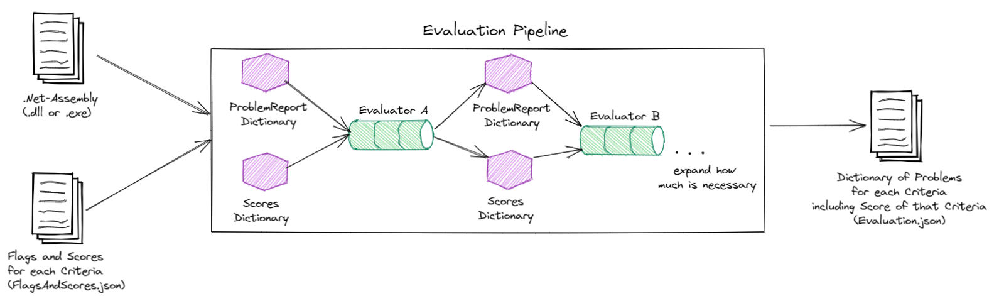

# API Concepts Framework
 API Concepts Framework in C# for analysing .NET-Assemblies

This is a program written in C# that can be used to evaluate .NET-Assemblies regarding the useablity of the API.
This program will be developed during the work on my Bachelor-Thesis at the FH Hagenberg (Austria).

# General Idea


The User gets to specify the .NET-Assembly to analyse, which will then be loaded into memory using the `System.Reflection.Assembly` Type.
The program runs through multiple `Evaluators`, which analyse the Assembly on a specific Criteria (i.e. ParameterCount of Class-Methods).

To make an `Evaluator`, a class has to implement the `IEvaluator`-Interface.
```cs
interface IEvaluator
{
    public void Evaluate(Assembly assembly, Dictionary<Criteria, List<ProblemReport>> problems, Dictionary<Criteria, int> score);
}
```

The basic idea is, to run any test on the assembly and then update problems and scores for the test that was performed.

# Evaluation Pipeline in Code
```cs
private static void EvaluateAssembly(Assembly assembly,
                        Dictionary<Criteria, List<ProblemReport>> problems,
                        Dictionary<Criteria, int> scores)
        {
            var fas = JsonConvert.DeserializeObject<FlagsAndScores>(File.ReadAllText("FlagsAndScores.json"));

            List<IEvaluator> evaluatorList = new()
            {
                new MethodEvaluator(fas)
                //add all Evaluator here
            };

            foreach (var evaluator in evaluatorList)
            {
                //automaticly run all evaluations
                evaluator.Evaluate(assembly, problems, scores);
            }
        }
```
